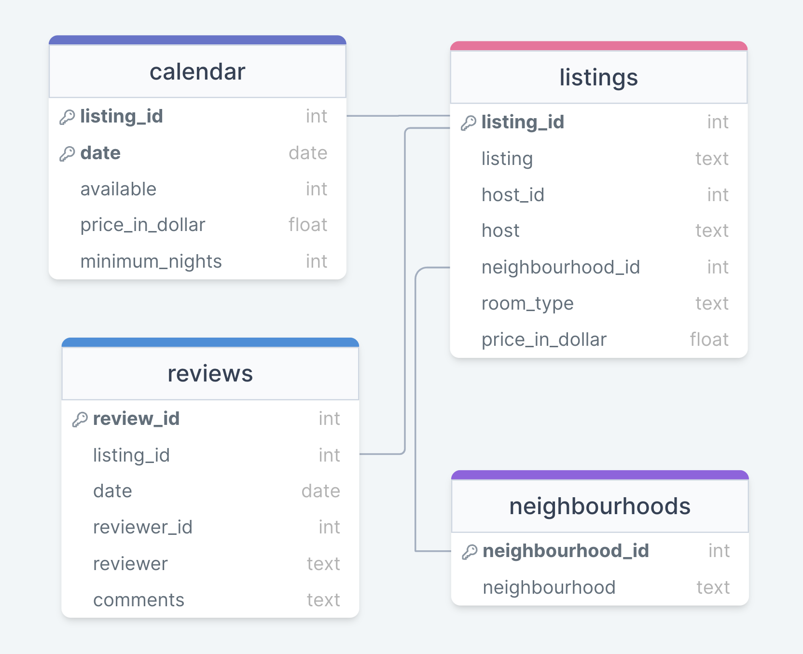

<h1> Airbnb Project</h1>

**Airbnb Project Part 1: Launching Airbnb Sydney**

*Role: The general manager of Sydney area at Airbnb*

In this role we carry out some analysis to find out more about the properties onboarded by my team and answer certain questions as they arise.
We already have cleaned data for our analysis process. We use the data available to help with the analysis. See data table here [Table](https://github.com/LJ-Luka/LJ-Luka.github.io/blob/main/Airbnb_sydney_data_tables.png)

The analysis was done by querying the table in the above link. See questions that arose (through scenarios) and queries used to answer them here [Document](https://github.com/LJ-Luka/LJ-Luka.github.io/blob/main/Airbnb_Sydney_Project)

**Airbnb Project Part 2: Scaling**

I need to make data-driven decisions about my region, as the general manager for Airbnb Sydney. I have had a few encounters with hosts calling in, and anticipate many more calling in that will require the use of SQL in the future. Below are some scenarios.

